# Simple Todo App with MongoDB, Express.js and Node.js
The ToDo app uses the following technologies and javascript libraries:
* MongoDB
* Express.js
* Node.js
* express-handlebars
* method-override
* connect-flash
* express-session
* mongoose
* bcryptjs
* passport
* docker & docker-compose

## What are the features?
You can register with your email address, and you can create ToDo items. You can list ToDos, edit and delete them. 

# How to use
First install the depdencies by running the following from the root directory:
```
npm install --prefix src/
```

To run this application locally you need to have an insatnce of MongoDB running. A docker-compose file has been provided in the root director that will run an insatnce of MongoDB in docker. TO start the MongoDB from the root direction run the following command:

```
docker-compose up -d
```

Then to start the application issue the following command from the root directory:
```
npm run start --prefix src/
```

The application can then be accessed through the browser of your choise on the following:

```
localhost:5000
```

## Testing

Basic testing has been included as part of this application. This includes unit testing (Models Only), Integration Testing & E2E Testing.

### Linting:
Basic Linting is performed across the code base. To run linting, execute the following commands from the root directory:

```
npm run test-lint --prefix src/
```

### Unit Testing
Unit Tetsing is performed on the models for each object stored in MongoDB, they will vdaliate the model and ensure that required data is entered. To execute unit testing execute the following commands from the root directory:

```
npm run test-unit --prefix src/
```

### Integration Testing
Integration testing is included to ensure the applicaiton can talk to the MongoDB Backend and create a user, redirect to the correct page, login as a user and register a new task. 

Note: MongoDB needs to be running locally for testing to work (This can be done by spinning up the mongodb docker container).

To perform integration testing execute the following commands from the root directory:

```
npm run test-integration --prefix src/
```

### E2E Tests
E2E Tests are included to ensure that the website operates as it should from the users perspective. E2E Tests are executed in docker containers. To run E2E Tests execute the following commands:

```
chmod +x scripts/e2e-ci.sh
./scripts/e2e-ci.sh
```

## Deployable Package
A command has been included that allows you to package up the application into a deployable artifact (tarball). To do this, from the root directory, enter the following command:

```
make pack
```
This command will pack the application into a tar and copy it into the `ansible/files` folder that can be used by ansible to deploy to a target machine. 


## Terraform
### Bootstrap
A set of bootstrap templates have been provided that will provision a DynamoDB Table, S3 Bucket & Option Group for DocumentDB in AWS. To set these up, ensure your AWS Programmatic credentials are set in your console and execute the following command from the root directory

```
make bootstrap
```

### Initalising your TF Repo
To initialise your terraform repo, run the following commands from your root directory

```
make tf-init
```

### Validate your TF Code
To validate & format your terraform repo, run the following command from your root directory

```
make tf-validate
```
# Solution

## Pass

### Stage A

The overall goal is to implement AWS cloud deployments via terraform, including VPC, EC2, S3, load balancing, etc., as well as devops using circleCI, and a detailed description of the steps will appear below.

### Stage B

Q: Run the environment bootstrap templates & also generate an artifact that you can use in the next few steps (refer to the Readme &/or Makefile for both). 

Solution: The problem is the need to generate a deployable file and the use of a bootstrap template. As documented above, the goal can be accomplished by simply using the following command.

```bash
# make a deployable package
make pack
```

after this command, a tar file is generated in `ansible/file` folder. Just like this:

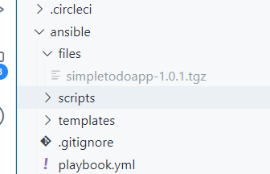

The next step will be to test the use of the template file with the following command: 

```bash
# test the template 
make bootstrap
```  

this is the terminal output.
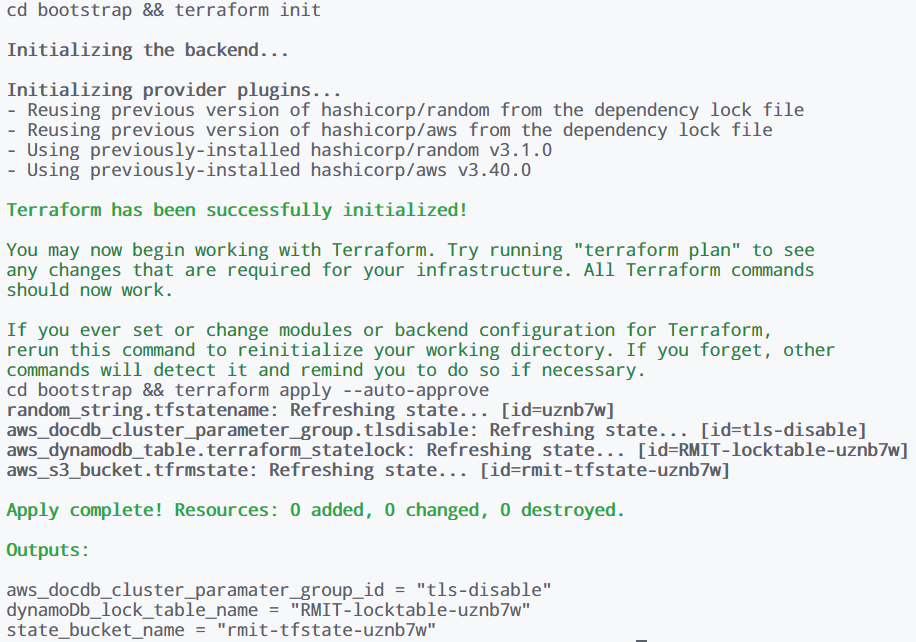

Resources successfully created.
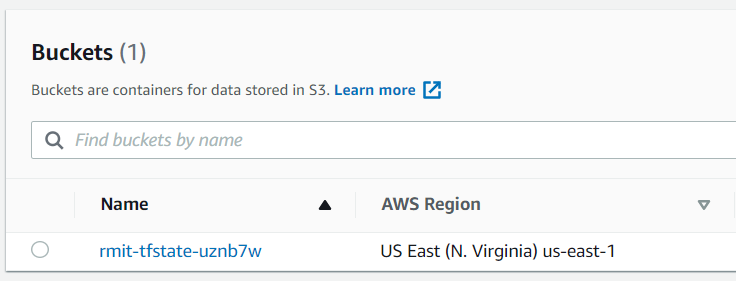

then the following command `make tf-init` and `make tf-validate` are also OK. No more screenshots here.

### Stage C

In this Stage, The things to do are "Create a VPC in terraform with 3 layers across 3 availability zones (9 subnets). Public, Private, and Data."

Use module is a better choice, so I user [AWS VPC Terraform module](https://registry.terraform.io/modules/terraform-aws-modules/vpc/aws/latest) for a quick way.

The configuration file is defined in the [vpc.tf](./infra/vpc.tf) file, executed by the following command：

```bash
# download the module and dependency
make tf-init
# confirm changes to be made
make tf-plan
# apply the change
cd infra && terraform apply
```

The VPC was created successfully and the screenshot is shown below: 
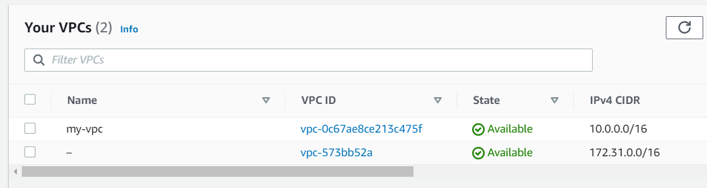
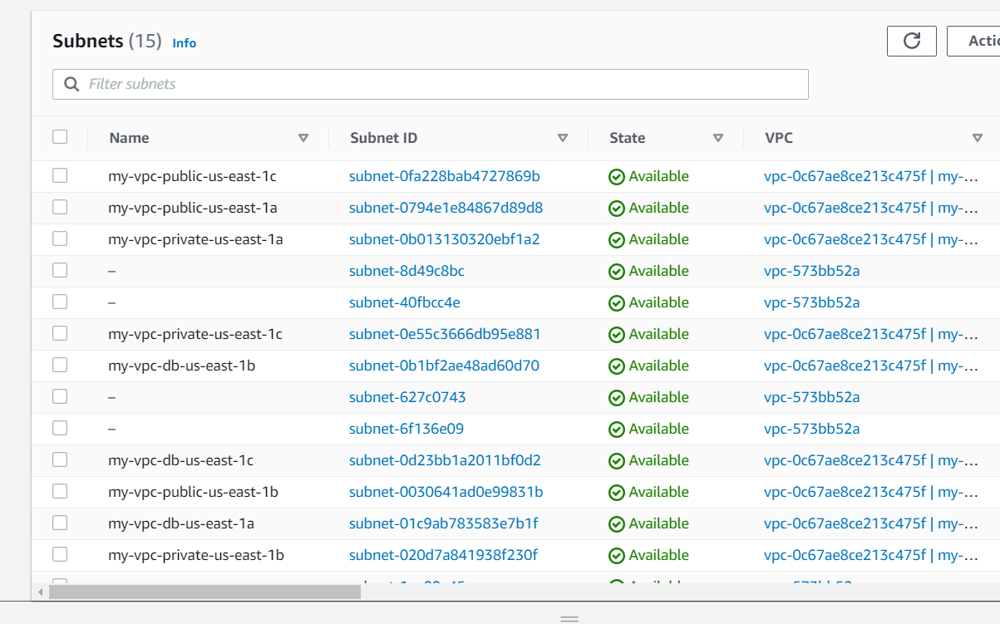


### Stage D

#### LoadBalaner

For the LoadBalaner creation I again used the official AWS template [alb](https://registry.terraform.io/modules/terraform-aws-modules/alb), then add a 80 port target group and listener on it. Detailed configuration can be found at [lb.tf](./infra/lb.tf)

Screenshot after success: 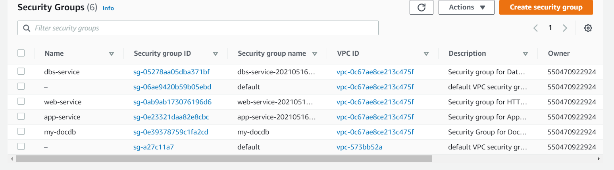

#### EC2

For the EC2 instance creation I again used the official AWS template [ec2-instance](https://registry.terraform.io/modules/terraform-aws-modules/ec2-instance), the whole config is in [ec2.tf](./infra/ec2.tf)

screenshot after success: 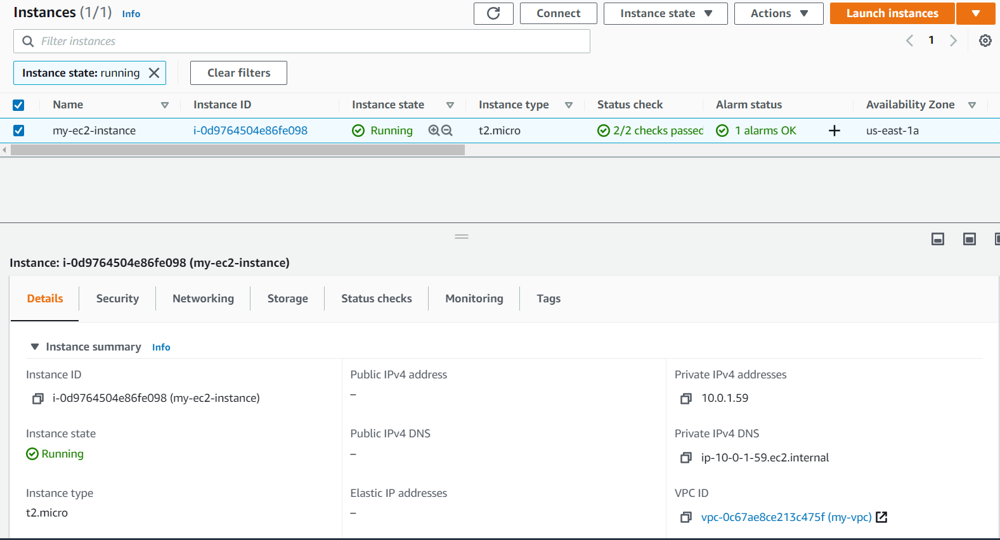

#### Database

For the DocDB creation I again used the non-offical template [documentdb-cluster](https://registry.terraform.io/modules/cloudposse/documentdb-cluster), the whole config is in [db.tf](./infra/db.tf)

screenshot after success: 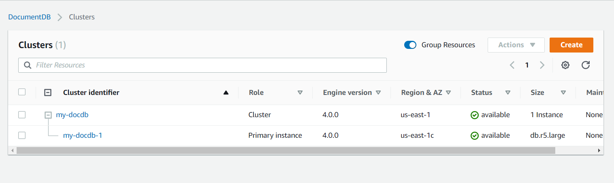

#### Security Group

Three separate groups of rules were defined when creating the security group rules, websg,appsg,dbssg, the remaining two groups are inherited from the first group with minor changes. Configuration is in [sg.tf](./infra/sg.tf)

screenshot after success: 

### Stage E

I used ansible to first upload the packaged packages to the server, then executed npm install, then uploaded the service files to the server and used systemd to manage them, and used the [run-ansible.sh ](./ansible/scripts/run-ansible.sh)  script file to get the Ec2 and DocDB entry points. Ansible playbook is [playbook.yml](./ansible/playbook.yml)

```bash
cd ansible/scripts
bash run-ansible.sh 
```

[run-ansible.sh ](./ansible/scripts/run-ansible.sh) dynamically generates the web host and db host via terraform output.  
screenshot is here: 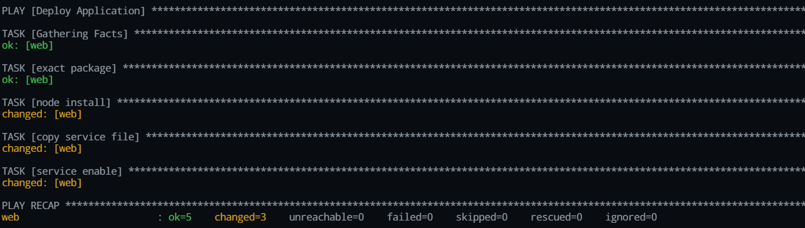

## Credit
By default terraform's state file is saved locally, however this is very prone to loss, so it is possible to throw this state into the cloud for storage, e.g. S3 bucket

```bash
terraform {
  backend "s3" {
    bucket         = "rmit-tfstate-uznb7w"
    key            = "stage/data-stores/terraform.tfstate"
    region         = "us-east-1"

    dynamodb_table = "RMIT-locktable-uznb7w"
    encrypt        = true
  }
  # ...other code
}
```
The configuration shown above is a change of the backend to the S3 Bucket.
screenshot here: 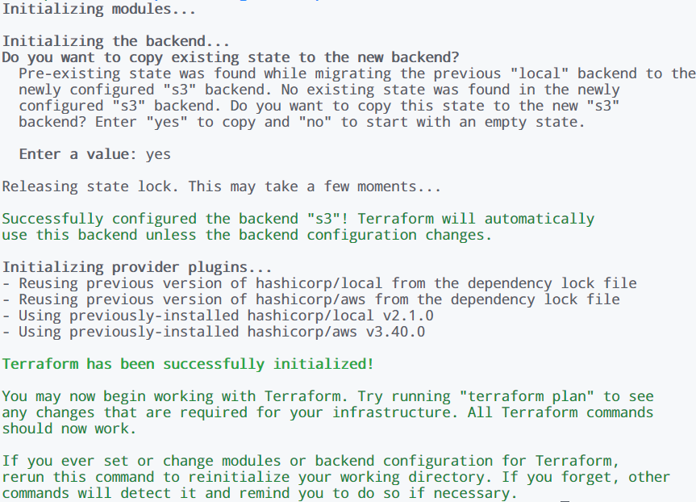


## Distinction

When creating the instance of EC2, I used the option of data directly and defined the definition of ami in this section, like the following:

```bash
data "aws_ami" "latest-ubuntu" {
  most_recent = true
  owners      = ["099720109477"] # Canonical

  filter {
    name   = "name"
    values = ["ubuntu/images/hvm-ssd/ubuntu-xenial-16.04-amd64-server-*"]
  }

  filter {
    name   = "virtualization-type"
    values = ["hvm"]
  }
}
```
The `most_recent` option here represents the most recent version of AMI.


Because of the convenience of the module used, I only had to change the instance_count to 2, and that was all I needed. Just like below:

```bash
module "ec2_instance" {
  # other code
  # instance_count = 1
  instance_count = 2
  # other code
}
```

## High Distinction

The modified CircleCI configuration file is [here](./.circleci/config.yml).

screenshot after success build: 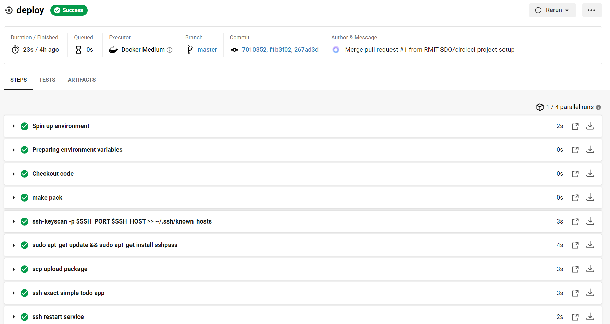


###### This project is licensed under the MIT Open Source License
